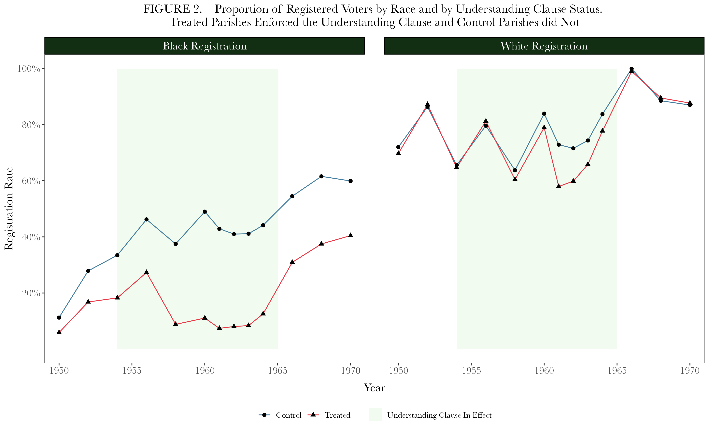

# Data Visualization - Sample Code

## Project summary

The below is an example of a data visualization I designed and executed using ggplot2. The plot is an attempt to refine and improve upon figure 2 of the 2021 article published by Keele, et al. ([Suppressing Black Votes: A Historical Case Study of Voting Restrictions in Louisiana](https://www.cambridge.org/core/journals/american-political-science-review/article/suppressing-black-votes-a-historical-case-study-of-voting-restrictions-in-louisiana/662970B089BC99495ADC2F6E3CBF61FD)) which shows the racial disparity in voter registration rates under the mid-20th century "Understanding Clause" which required Louisiana voters to provide a "‘reasonable interpretation’ of a section of the state’s constitution" before voting.

The code chunk begins by filtering NA values from the data, then grouping it by year, understanding clause status, and race. It then establishes a grid and line graph using year and registration rate as x and y variables, respectively. The rest of the code chunk refines the visualization to make it more digestible and intuitive, focusing on contrasting colors, font size and spacing, labeling, and readability. It also improves upon the original chart by adding a highlighted section for the years affected by the Understanding Clause in order to highlight the linkage between the clause's implementation and registration disparities.

I've included the code below along with the output generated upon its execution:

## Visualization



## [Code Chunk]()
* See file [here](https://github.com/jrb0/portfolio/blob/main/data_visualization.r) for syntax-highlighted code. 

```
# Filter out rows with missing year or registration rate
filter(la_turnout_long, !is.na(year), !is.na(regrate)) %>%
  
  # Group by year, treatment status, and race
  group_by(year, understandingclause2, race) %>% 
  
  # Calculate the mean registration rate per group
  summarize(mean_regrate = mean(regrate, na.rm = TRUE)) %>%
  
  # Begin plotting
  ggplot(aes(
    x = year, 
    y = mean_regrate, 
    color = understandingclause2, 
    shape = understandingclause2, 
    group = understandingclause2
  )) +  
  
  # Add shaded background for "Understanding Clause In Effect" period (1954–1965)
  geom_rect(
    aes(
      xmin = 1954, xmax = 1965, 
      ymin = 0, ymax = 1, 
      fill = "Understanding Clause In Effect"
    ), 
    alpha = 1, inherit.aes = FALSE
  ) +
  
  # Add line plot of registration rates over time
  geom_line() +
  
  # Add black points at data locations
  geom_point(size = 2, color = "black") +
  
  # Set x-axis range and tick marks
  scale_x_continuous(
    limits = c(1950, 1970),
    breaks = c(1950, 1955, 1960, 1965, 1970)
  ) +
  
  # Set y-axis as percentages with breaks and labels
  scale_y_continuous(
    limits = c(0, 1),
    breaks = c(0.2, 0.4, 0.6, 0.8, 1.0),
    labels = scales::percent
  ) +
  
  # Set manual color scheme: red for Treated, blue for Control
  scale_color_manual(
    values = c("0" = "#427c9e", "1" = "#e83645"),
    labels = c("0" = "Control", "1" = "Treated")
  ) +
  
  # Use different shapes for Control and Treated
  scale_shape_manual(
    values = c("0" = 16, "1" = 17),
    labels = c("0" = "Control", "1" = "Treated")
  ) +
  
  # Set fill color for the shaded treatment period
  scale_fill_manual(
    values = c("Understanding Clause In Effect" = "#f1fbef")
  ) +
  
  # Add plot title and axis labels
  labs(
    title = "FIGURE 2.    Proportion of Registered Voters by Race and by Understanding Clause Status. \nTreated Parishes Enforced the Understanding Clause and Control Parishes did Not", 
    x = "Year", 
    y = "Registration Rate"
  ) +
  
  # Facet the plot by race using custom labels
  facet_wrap(~ race, labeller = labeller(race = custom_labels)) +
  
  # Apply a clean white background theme
  theme_bw() +
  
  # Customize theme elements for typography and layout
  theme(
    axis.text = element_text(size = 12, family = "Baskerville"),
    axis.title = element_text(size = 14.5),
    axis.title.x = element_text(margin = margin(t = 9), family = "Baskerville"),
    axis.title.y = element_text(margin = margin(r = 2), family = "Baskerville"),
    plot.title = element_text(size = 15, margin = margin(b = 10), 
                              family = "Baskerville", hjust = 0.5, vjust = 1),
    legend.text = element_text(size = 10, family = "Baskerville"),
    legend.title = element_blank(),
    panel.grid = element_blank(),
    panel.spacing = unit(0.8, "cm"),
    legend.position = "bottom",
    strip.text = element_text(size = 14, family = "Baskerville", color = "white"),
    strip.background = element_rect(fill = "#132F13", color = "black", size = 1)
  )
```

